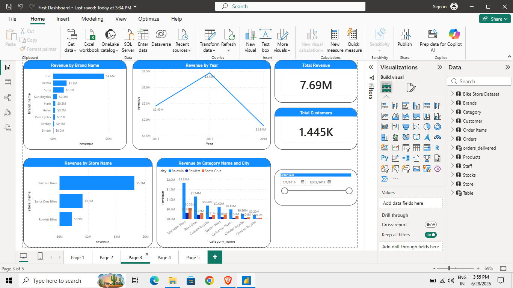

# Bike Store Sales Dashboard
Power BI dashboard analyzing bike store sales data

## Key Insights
- Trek brand generates $4.6M (59% of total revenue)
- Baldwin Bikes store leads with $5.2M in sales
- Total Revenue: $7.69M across 1,445 customers

## Tools Used
Power BI, DAX (YTD/MTD/QTD time intelligence measures)

## Dataset
Bike Store dataset

## File
Download `First Dashboard.pbix` to explore interactively in Power BI Desktop.
